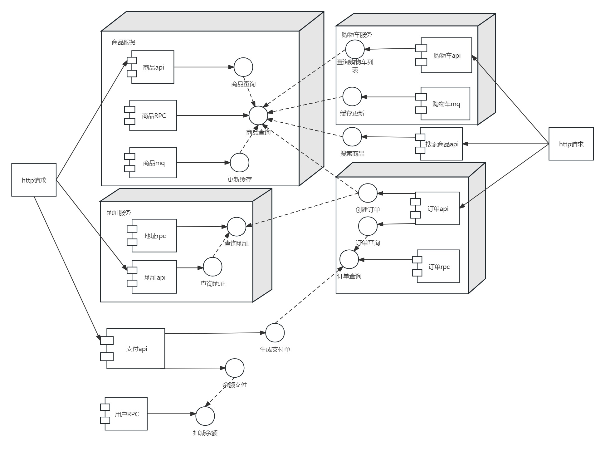

# 黑马商城

## 1、项目介绍

#### 黑马程序员的spring cloud微服务项目，这里采用go-zero框架实现

## 2、技术栈

#### etcd + mysql + redis + kafka

## 3、服务拆分

- #### 用户服务

- #### 商品服务

- #### 订单服务

- #### 购物车服务

- #### 支付服务

## 4、相关模块对RPC方法的依赖

- #### 查询购物车列表功能需要对商品的查询，所以其依赖商品查询的rpc方法，同理搜索商品也是如此

- #### 因为商品api服务中也要提供商品查询的功能，所以其也依赖商品查询的rpc方法

- #### 订单api服务中需要扣减用户的余额，所以依赖用户扣余额的RPC方法

- #### 商品的mq服务提供了更新缓存方法，实现通过消息队列异步更新缓存的功能，因为商品查询的rpc方法有写缓存的功能，所以直接依赖它