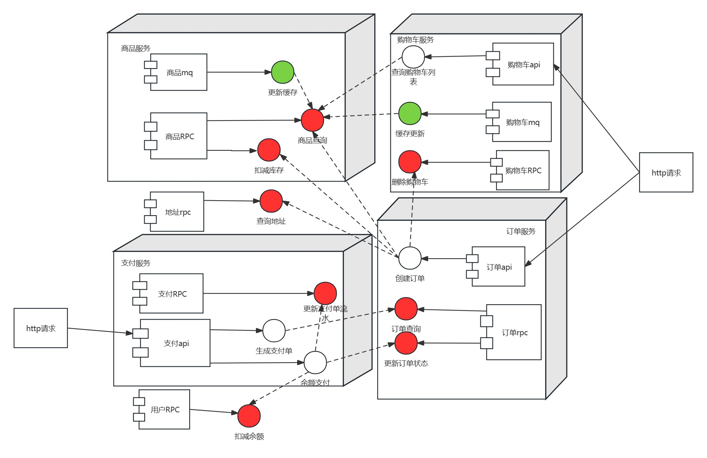
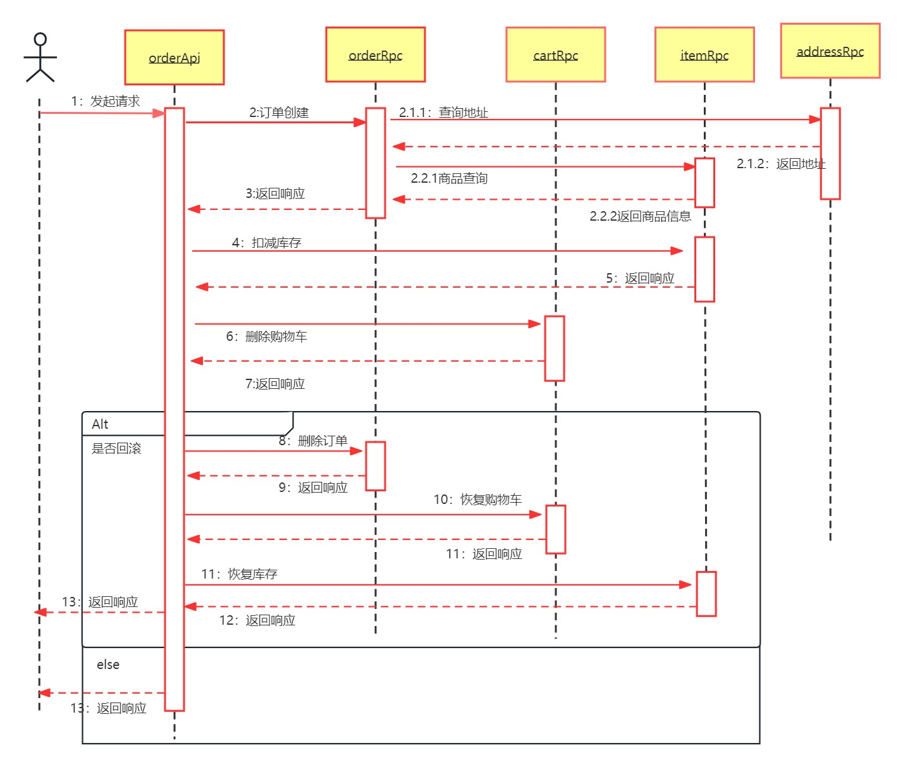

# 黑马商城

## 一、项目介绍

#### 黑马程序员的spring cloud微服务项目，这里采用go-zero框架实现

## 二、技术栈

#### etcd + mysql + redis + kafka +dtm

## 三、服务拆分

- #### 用户服务

- #### 商品服务

- #### 订单服务

- #### 购物车服务

- #### 支付服务

## 四、相关模块对RPC方法的依赖(红色为rpc服务，绿色mq服务，白色为api服务)

### 1、商品服务的RPC方法，商品查询

- #### 商品服务更新时，通过mq服务更新缓存

- #### 查询购物车列表，需要返回对应的商品信息

- #### 购物车更新时，也是通过对应mq服务更新购物车列表缓存

- #### 创建订单时也要用到商品信息

### 2、商品服务的RPC方法，扣减库存

- #### 在订单服务中创建订单时，需要扣减相应商品的库存

### 3、地址管理服务的RPC方法，查询地址

- #### 在订单服务中创建订单时，需要获取用户的地址

### 4、订单服务的RPC方法，订单查询

- #### 在支付服务中生成支付单时，要用到订单的信息

### 5、订单服务更新订单状态

- #### 在支付服务中的余额支付成功后，改变订单状态

### 6、用户服务的RPC方法，扣减余额

- #### 在支付服务中使用余额支付，会调用到扣余额的服务

### 7、删除购物车

- #### 在订单服务中创建订单时，需要删除购物车中下单的商品

### 8、支付服务RPC，更新支付单流水

- #### 在支付服务中的余额支付成功后，更新订单流水

## 五、分布式事务

### 1、订单创建服务

#### 该服务中需要完成

- #### 订单创建

- #### 删除购物车

- #### 扣减库存

#### 事务具体逻辑

- #### 时序图

- #### 三项事务使用DTM进行控制，订单创建中的地址查询和商品查询是并发执行，然后需要写入三张表，订单表、订单详情表、订单物流表也是并发执行

- #### 每一项事务提供对应回滚方法

### 2、支付服务

#### 该服务中需要完成

- #### 余额支付

- #### 更新订单流水

- #### 改变订单状态