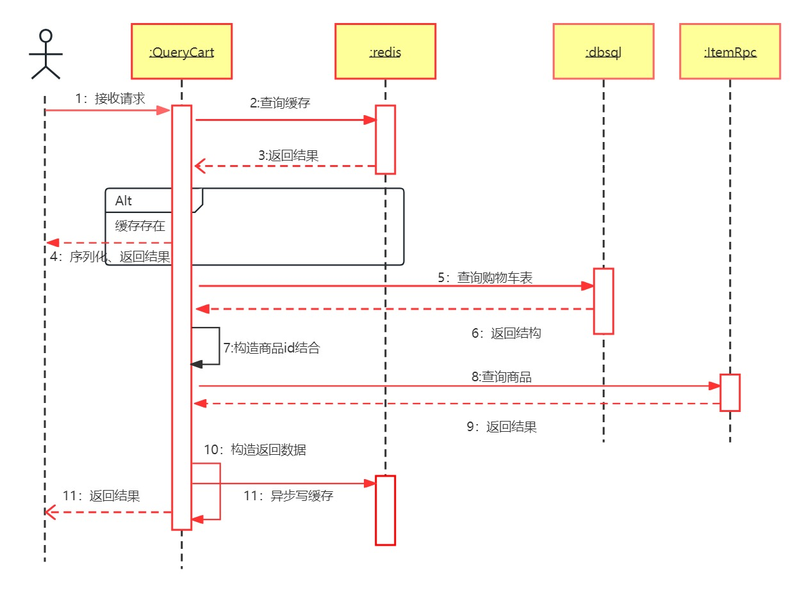

# 商品服务开发文档

## 一、项目功能

### 1、api服务

- #### 查询购物车列表 （query_cart_logic.go)

  

  > - 先查询缓存的数据，有则序列化后返回
  > - 没有则查询购物车数据库，获得商品id结合
  > - 调用商品服务的RPC方法获得商品信息
  > - 构造数据返回，同时并发写缓存，失败后调用mq服务异步写缓存

- #### 添加商品到购物车 （add_cart_logic.go）

  > - 修改数据库，获取购物车的id
  > - 调用mq服务异步添加缓存

- #### 更新购物车数据（update_cart_logic.go）

- #### 批量删除购物车中商品（del_cart_items_logic.go）

- #### 删除购物车中商品（del_cart_item_logic.go）

  > - 以上三个方法相同操作
  > - 修改数据库
  > - 删除缓存，如果失败调用mq服务异步删除缓存

### 2、mq服务（缓存补偿：api服务中先写缓存，失败后调用mq服务）

- #### 添加缓存,需要查询商品信息
  > - 根据商品Id调用商品服务的RPC方法查找购物车的商品，构建购物车数据，最后加入缓存
  
- #### 删除缓存（缓存补偿）
  > - 根据购物车id和用户id删除缓存

- #### 添加缓存,不需要查询商品信息 （缓存补偿）
  > - 查询商品列表对应的缓存补偿方法，其api服务中在尝试写缓存时已经将信息序列化完成
  > - 根据购物车id和用户id以及“else”字段的值直接写缓存

### 3、RPC服务

- #### 删除购物车（del_carts_logic.go）

  > - 软删除购物车，删除缓存

- #### 删除购物车回滚方法（del_carts_roll_back_logic.go）

  > - 恢复购物车，创建缓存