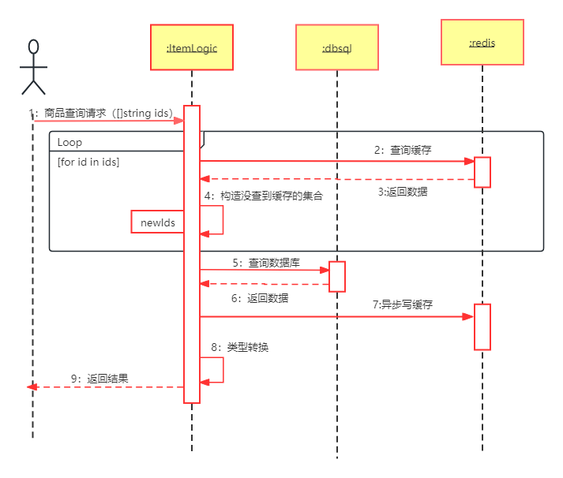
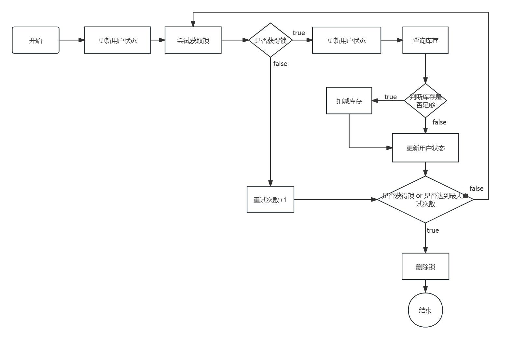

# 商品服务开发文档

## 一、项目功能

### 1、api服务

- #### 批量查询商品 （find-item-by-id-logic.go)

  > 根据请求中的id数组，调用RPC中的商品查询

- #### 分页查询商品（query-item-page-logic.go）

  > - 查询数据库 + 添加缓存
  > - 采用每页都设置缓存的方式

- #### 查询商品（find-item-by-id-logic.go）

  > 调用rpc方法查询

- #### 新增商品 （additem-logic.go）
  > - 调用数据库执行操作
  > - 缓存使用hash存储，字段为整个对象、库存、状态
  > - 调用search的mq服务同步es，与缓存并发执行

- #### 更新商品（update-item-logic.go）

  > - 采用更新数据库 + 更新缓存方法，这里更新的是除了状态和库存的其它字段
  > - 该操作的并发量不大，所以忽略了并发问题
  > - 调用search的mq服务同步es，与缓存并发执行

- #### 更新商品状态（update-item-status-logic.go）

  > - 采用更新数据库 + 更新缓存方法，
  > - 该操作的并发量不大，所以忽略了并发问题
  > - 根据状态判断在es中，是删除还是创建，与缓存并发执行

- #### 批量扣减库存（deduct-items-logic.go）

  > - 采用更新数据库 + 更新缓存方法，
  > - 更新缓存时使用redis分布式锁，对对应商品加锁，减去对应库存，使用lua脚本执行
  > - 调用search的mq服务同步es，与缓存并发执行

- #### 删除商品（del-item-by-id-logic.go）

  > - 采用更新数据库 + 删除缓存方法，
  > - 删除缓存和同步Es，并发执行

### 2、RPC服务

- #### 商品查询（find-item-by-ids-logic.go）

  > - 查询缓存命中时会构造对象
  > - 查询数据库结束后根据结果写缓存
  > - 构造对象和写缓存是并发执行

- #### （普通商品）扣减库存以及回滚（del-stock-logic.go、del-stock-roll-back-logic.go）

  > 修改数据库，同步缓存和es

- #### （秒杀商品）扣减库存

  
  > - 执行lua脚本进行扣减
  > - 通过加锁控制扣减动作
  > - 并且写入当亲用户的秒杀状态，提供给创建订单服务判断是否下单，同时也标志该用户是否参与过秒杀

- #### 获取用户秒杀状态
  
  > - 查询扣减库存设置的秒杀状态

### 3、mq服务

> - 进行缓存补偿
> - 分为四种类型 0、全字段添加；1、更新部分字段；2，更新库存；3、更新状态；4、删除