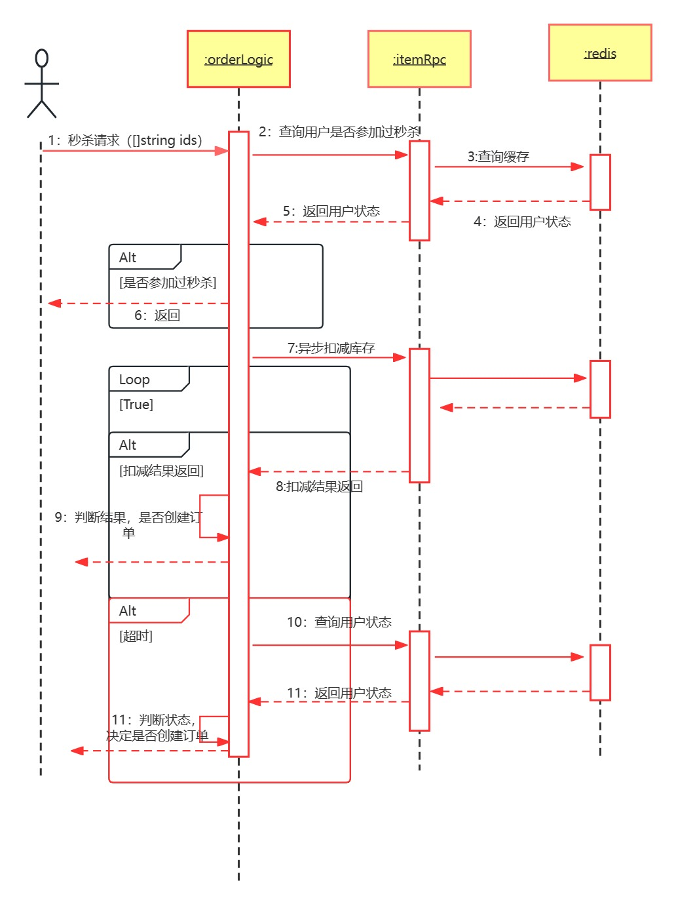

# 订单服务

## 一、api服务

### 1、创建订单（create_order_logic.go）

- #### 分布式事务，调用三个rpc方法，订单服务的创建订单，商品服务的扣减库存，购物车服务的删除购物车

### 2、查询订单（find_order_by_id_logic.go）

- #### 调用数据库查询

### 3、标记订单为已支付（mark_order_logic.go）

- #### 调用数据库修改

### 4、创建秒杀订单（mark_order_logic.go）

> - 查询用户是否已经参与过秒杀
> - 异步执行扣减库存
> - 主线程等待结果同时进行超时检查
> - 结果成功返回，根据结果判断是否进行创建订单
> - 如果超时，查询用户状态
> - 如果用户已经扣减库存，进行创建订单
> - 如果用户还未开始秒杀或扣减库存失败，退出事务
> - 如果用户正在进程秒杀，进行等待再查询用户状态

## 二、RPC服务

### 1、创建订单（createorderlogic.go）

- #### 并发查询地址和商品信息

- #### 写入订单表，获得订单Id

- #### 并发创建订单详情表，订单物流表和写缓存

### 2、创建订单回滚方法（createorderrollbacklogic.go）

- #### 并发删除订单，订单详情表，订单物流表，缓存

### 3、修改订单状态（updateorderstatuslogic.go）

### 4、修改订单状态回滚方法（updateorderstatusrollbacklogic.go）

- #### 修改数据库

### 5、查询订单（findorderbyidlogic.go）

- #### 查新缓存

- #### 缓存不存在查询数据库